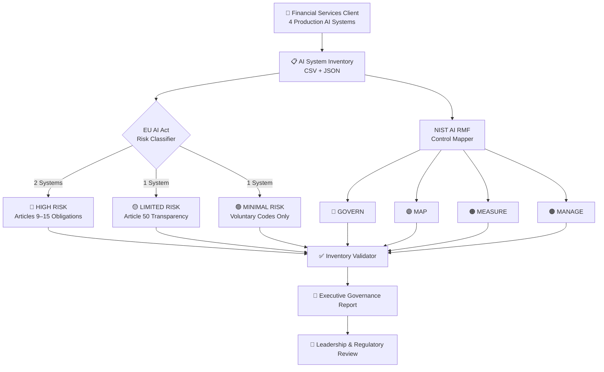
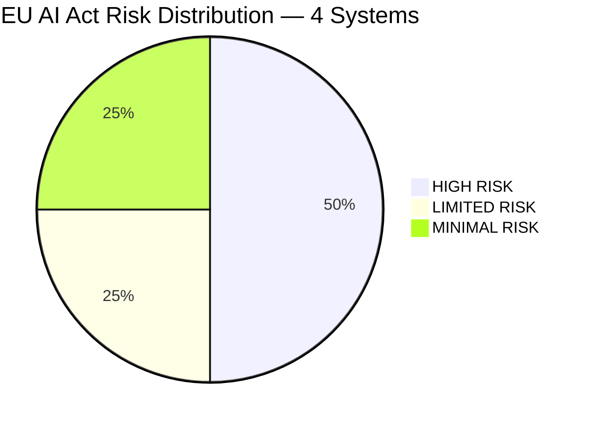
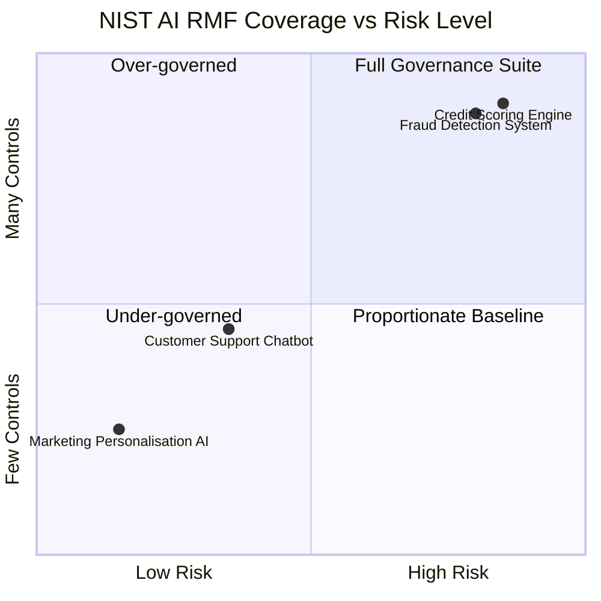

<div align="center">

# 🤖 AI System Inventory & Classification Engine

[](https://artificialintelligenceact.eu/)
[](https://airmf.nist.gov/)
[](https://www.python.org/)
[](LICENSE)
[]()

</div>

---

## 📌 Project Overview

I built a complete, end-to-end **AI Governance framework** for a financial services client that had no visibility into what AI systems it was running, how risky they were, or what regulatory obligations applied to each one.

The engagement covered four production AI systems across credit scoring, fraud detection, customer support, and marketing. I designed and delivered a structured inventory, applied EU AI Act risk classification with documented legal reasoning, mapped every system to the NIST AI Risk Management Framework, and produced an automated governance report ready for leadership and regulatory review.

> **The core problem I solved:** The client could not answer a basic but critical question — *"What AI systems are we operating, and are we compliant?"* This project gave them a defensible, auditable answer.

---

## 🎯 What I Delivered

| Deliverable | Description |
|---|---|
| **AI System Inventory** | Structured CSV + JSON capturing all AI systems, owners, data sources, and review cycles |
| **EU AI Act Classification** | Risk-tiered classification for each system with full legal reasoning and obligations |
| **NIST AI RMF Mapping** | Control mapping across all four RMF functions per system, proportionate to risk |
| **Automated Validator** | Python script that checks inventory completeness and flags governance gaps |
| **Governance Report** | Executive-ready report generated directly from the inventory data |

---

## 🗺 Architecture & Data Flow



---

## 🔍 AI Systems Inventoried

I inventoried and assessed four AI systems across the client's operations:

| ID | System | Purpose | Sector | Automated Decision |
|---|---|---|---|---|
| NP-001 | Credit Scoring Engine | Assesses creditworthiness and determines loan eligibility | Financial Services | ✅ Yes |
| NP-002 | Fraud Detection System | Real-time transaction fraud detection with automatic holds | Financial Services | ✅ Yes |
| NP-003 | Customer Support Chatbot | Tier-1 customer query handling via LLM-powered chat | General Purpose | ❌ No |
| NP-004 | Marketing Personalisation AI | Customer segmentation and campaign personalisation | Marketing | ❌ No |

---

## ⚖️ EU AI Act Risk Classification

I applied the EU AI Act's four-tier risk model to each system, with documented reasoning for every classification decision.



| System | Risk Tier | Regulatory Basis | Key Obligation |
|---|---|---|---|
| 🔴 Credit Scoring Engine | **HIGH RISK** | Annex III §5(b) — financial services | Articles 9–15: risk management, data governance, human oversight |
| 🔴 Fraud Detection System | **HIGH RISK** | Annex III §5(b) — financial services | Articles 9–15: logging, transparency, robustness testing |
| 🟡 Customer Support Chatbot | **LIMITED RISK** | Article 50(1) — conversational AI | Disclose AI nature to users at start of every session |
| 🟢 Marketing Personalisation AI | **MINIMAL RISK** | No Annex III classification | No mandatory obligations; voluntary codes encouraged |

**Key classification insight:** The two HIGH RISK systems are not high-risk because they are poorly built — they are high-risk because of *where* they operate (financial services) and *what* they decide (access to credit and funds). Classification determines obligations, not quality.

→ Full classification reasoning: [`docs/eu_ai_act_classification.md`](docs/eu_ai_act_classification.md)

---

## 🛡 NIST AI RMF Control Mapping

I mapped every system to the four functions of the NIST AI Risk Management Framework, applying controls proportionate to each system's risk tier.



| System | GOVERN | MAP | MEASURE | MANAGE | Total |
|---|---|---|---|---|---|
| 🔴 Credit Scoring Engine | 5 controls | 5 controls | 5 controls | 5 controls | **20** |
| 🔴 Fraud Detection System | 5 controls | 5 controls | 5 controls | 5 controls | **20** |
| 🟡 Customer Support Chatbot | 4 controls | 4 controls | 2 controls | 3 controls | **13** |
| 🟢 Marketing Personalisation AI | 4 controls | 4 controls | 2 controls | 3 controls | **13** |

The HIGH RISK systems received the full 20-control governance suite. The proportionality principle was applied deliberately — over-governing low-risk systems creates compliance fatigue without reducing actual risk.

→ Full control mapping: [`docs/nist_rmf_mapping.md`](docs/nist_rmf_mapping.md)

---

## ✅ Automated Governance Validation

I built a Python validation engine that checks the inventory against governance requirements before any report is generated. It runs 12 checks across every system:

```
[✓] No duplicate system IDs detected
[✓] All system IDs match expected format
[✓] [NP-001] All mandatory fields populated
[✓] [NP-001] HIGH RISK system has a named owner: 'Head of Credit Risk'
[✓] [NP-001] HIGH RISK system review cycle is within limit (6 months)
[✓] [NP-001] Human oversight documented for automated decision system
[✓] [NP-002] All mandatory fields populated
[✓] [NP-002] HIGH RISK system has a named owner: 'Head of Financial Crime'
[✓] [NP-002] HIGH RISK system review cycle is within limit (3 months)
[✓] [NP-002] Human oversight documented for automated decision system
[✓] [NP-003] All mandatory fields populated
[✓] [NP-004] All mandatory fields populated

Validation PASSED — All 12 checks completed successfully.
```

If any check fails, the script identifies the exact system and field so it can be corrected before the report goes to leadership.

---

## 📊 Governance Report

The final output is an automated, executive-ready governance report generated directly from the validated inventory data — no manual formatting required.

It covers:
- Full inventory summary with risk distribution
- Per-system EU AI Act obligations
- NIST AI RMF control coverage
- Prioritised recommended actions by risk tier
- 12-month review schedule

→ View the full report: [`docs/governance_report.md`](docs/governance_report.md)

---

## 📁 Repository Structure

```
AI-System-Inventory/
├── README.md                          ← You are here
├── configs/
│   ├── ai_inventory.csv               ← Structured inventory (spreadsheet-friendly)
│   └── ai_inventory.json              ← Structured inventory (machine-readable)
├── docs/
│   ├── eu_ai_act_classification.md    ← Full EU AI Act classification analysis
│   ├── nist_rmf_mapping.md            ← Full NIST AI RMF control mapping
│   └── governance_report.md           ← Auto-generated executive report
├── scripts/
│   ├── classify_systems.py            ← EU AI Act risk classifier
│   ├── map_to_rmf.py                  ← NIST AI RMF mapper
│   ├── validate_inventory.py          ← Governance gap validator
│   └── generate_report.py             ← Automated report generator
└── screenshots/
    └── README.md                      ← Screenshot guide
```

---

## 🧠 Skills Demonstrated

- **AI Governance** — Operationalising regulatory frameworks into structured, auditable artifacts
- **EU AI Act** — Risk-tier classification with documented legal reasoning across Annex III categories
- **NIST AI RMF** — Proportionate control mapping across GOVERN / MAP / MEASURE / MANAGE
- **Python Automation** — Inventory validation and automated report generation pipelines
- **Regulatory Analysis** — Translating legal text into actionable compliance obligations
- **Technical Writing** — Executive-ready governance documentation from structured data

---

## 📚 Frameworks & References

| Resource | Link |
|---|---|
| EU AI Act (Official Text) | [EUR-Lex 2024/1689](https://eur-lex.europa.eu/legal-content/EN/TXT/?uri=CELEX:32024R1689) |
| NIST AI Risk Management Framework 1.0 | [airmf.nist.gov](https://airmf.nist.gov/) |
| EU AI Act Annex III — High-Risk Systems | [EUR-Lex Annex III](https://eur-lex.europa.eu/legal-content/EN/TXT/?uri=CELEX:32024R1689#anx_III) |
| NIST AI RMF Playbook | [airc.nist.gov](https://airc.nist.gov/Docs/2) |

---

<div align="center">

**franciscovfonseca** · [GitHub](https://github.com/franciscovfonseca) · [LinkedIn](https://linkedin.com/in/franciscovfonseca)

[](LICENSE)

</div>
