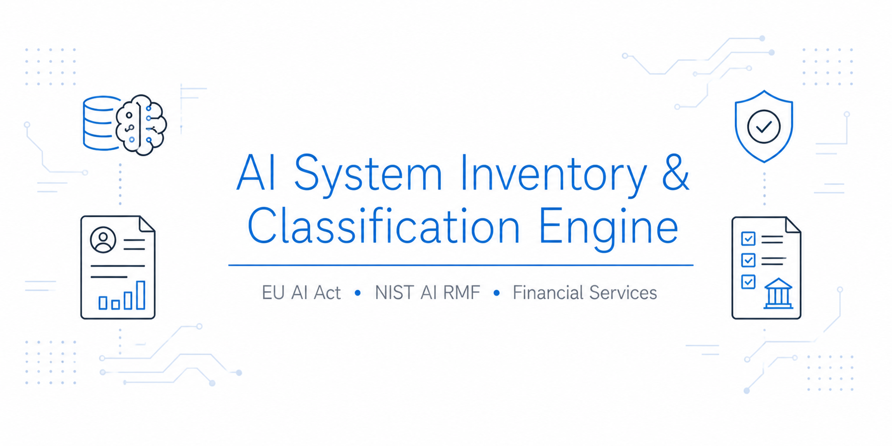
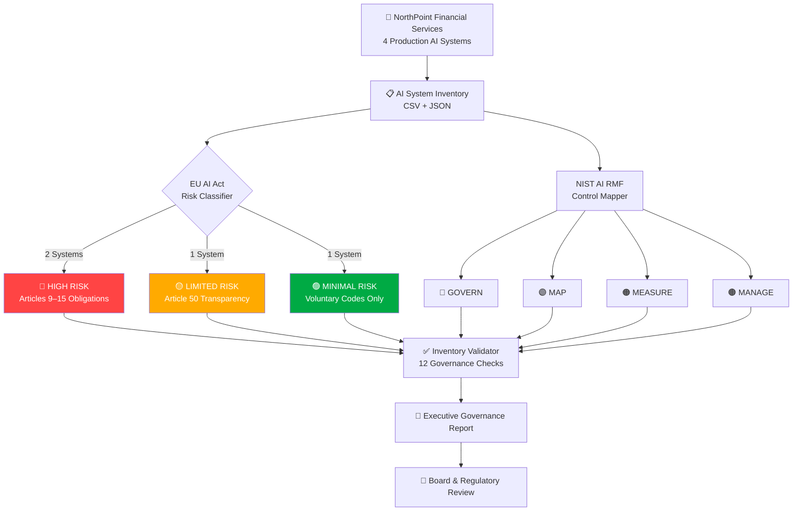
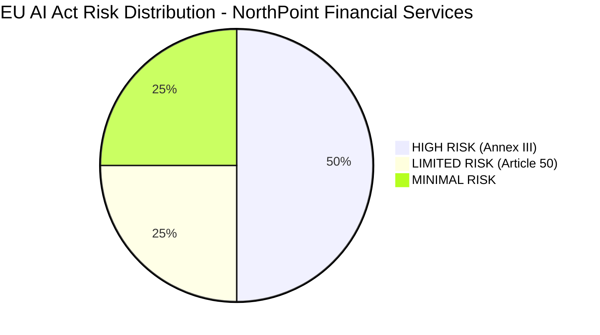
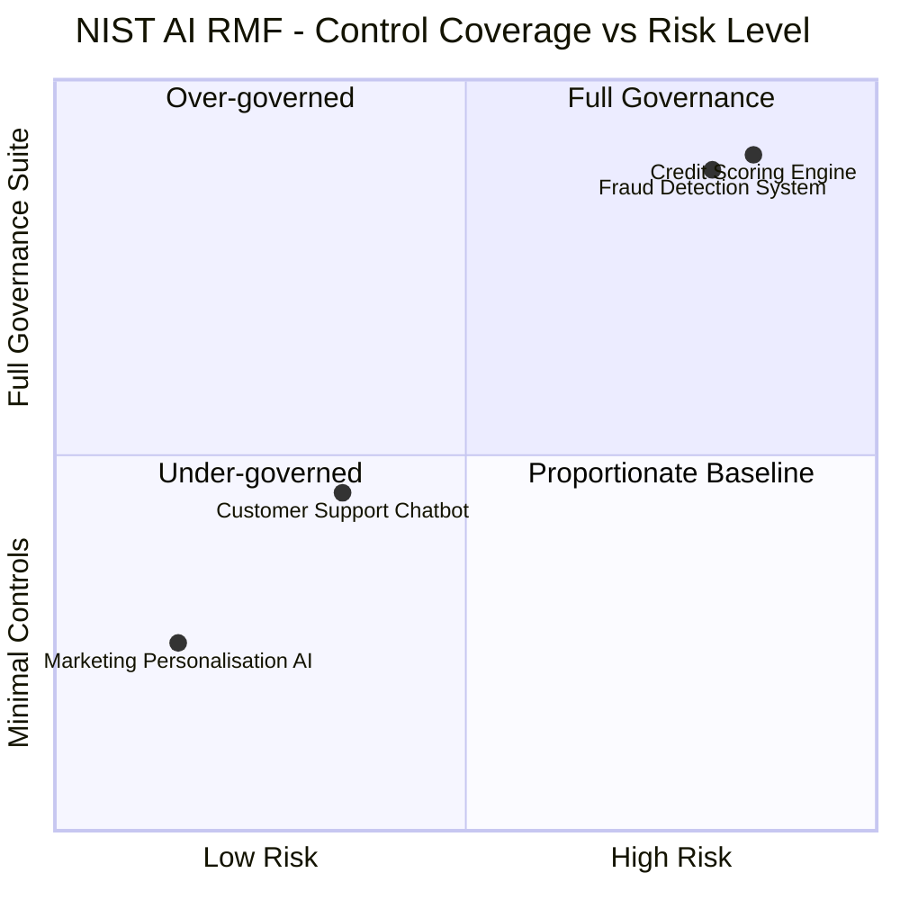

<div align="center">




# 🤖 AI System Inventory & Classification Engine

[](https://artificialintelligenceact.eu/)
[](https://airmf.nist.gov/)
[](https://www.iso.org/standard/81230.html)
[](https://www.python.org/)
[](LICENSE)
[]()

**Phase 1 of an end-to-end AI Governance Programme**

</div>

---

## 📌 Project Overview

**NorthPoint Financial Services** - a mid-size financial institution operating in the EU - had no centralised visibility into its AI systems. Leadership could not answer the most fundamental governance question: *"What AI are we running, how risky is it and are we compliant?"*

This project delivered that answer. I designed and executed a complete AI system inventory programme covering four production AI systems across credit, fraud, customer support and marketing. The output: a structured inventory, EU AI Act risk classification with full legal reasoning, NIST AI RMF control mapping, automated governance validation and an executive report ready for board and regulatory review.

> **The business impact:** NorthPoint can now demonstrate to regulators, auditors and the board exactly which AI systems it operates, what risk tier each carries, what obligations apply and what controls are in place - with documented, auditable evidence for every decision.

This project is **Phase 1** of an ongoing AI governance programme.

---

## 🎯 What I Delivered

| Deliverable | Description |
|---|---|
| **AI System Inventory** | Structured CSV + JSON capturing all AI systems, owners, data sources and review cycles |
| **EU AI Act Classification** | Risk-tiered classification for each system with full legal reasoning and regulatory obligations |
| **NIST AI RMF Mapping** | Control mapping across all four RMF functions per system, proportionate to risk level |
| **ISO 42001 Alignment** | High-level alignment check against ISO 42001 AI Management System requirements |
| **Automated Validator** | Python script that checks inventory completeness and flags governance gaps before reporting |
| **Executive Governance Report** | Board-ready report generated directly from validated inventory data |

---

## 🗺 Architecture & Data Flow



---

## 🔍 AI Systems Inventoried

| ID | System | Purpose | Sector | Automated Decision |
|---|---|---|---|---|
| NP-001 | Credit Scoring Engine | Assesses creditworthiness and determines loan eligibility | Financial Services | ✅ Yes |
| NP-002 | Fraud Detection System | Real-time transaction fraud detection with automatic holds | Financial Services | ✅ Yes |
| NP-003 | Customer Support Chatbot | Tier-1 customer query handling via LLM-powered chat | General Purpose | ❌ No |
| NP-004 | Marketing Personalisation AI | Customer segmentation and campaign personalisation | Marketing | ❌ No |

---

## ⚖️ EU AI Act Risk Classification

I applied the EU AI Act's four-tier risk model to each system, with documented reasoning for every classification decision.



| System | Risk Tier | Regulatory Basis | Key Obligations |
|---|---|---|---|
| 🔴 Credit Scoring Engine | **HIGH RISK** | Annex III §5(b) - creditworthiness assessment | Articles 9–15: risk management system, data governance, human oversight, transparency, logging |
| 🔴 Fraud Detection System | **HIGH RISK** | Annex III §5(b) - financial services | Articles 9–15: post-market monitoring, robustness testing, incident reporting |
| 🟡 Customer Support Chatbot | **LIMITED RISK** | Article 50(1) - conversational AI | Mandatory disclosure: users must know they are interacting with AI |
| 🟢 Marketing Personalisation AI | **MINIMAL RISK** | No Annex III classification | No mandatory obligations; voluntary codes of conduct encouraged |

> **Classification insight:** NP-001 and NP-002 are classified HIGH RISK not because of poor design, but because of *where* they operate (financial services) and *what* they decide (access to credit and funds). Under the EU AI Act, context determines classification - not quality.

→ Full classification reasoning: [`docs/eu_ai_act_classification.md`](docs/eu_ai_act_classification.md)

---

## 🛡 NIST AI RMF Control Mapping

Controls were applied proportionate to each system's risk tier across all four NIST AI RMF functions.



| System | GOVERN | MAP | MEASURE | MANAGE | Total Controls |
|---|---|---|---|---|---|
| 🔴 Credit Scoring Engine | 5 | 5 | 5 | 5 | **20** |
| 🔴 Fraud Detection System | 5 | 5 | 5 | 5 | **20** |
| 🟡 Customer Support Chatbot | 4 | 4 | 2 | 3 | **13** |
| 🟢 Marketing Personalisation AI | 4 | 4 | 2 | 3 | **13** |

The HIGH RISK systems received the full 20-control governance suite. The proportionality principle was applied deliberately - applying full controls to low-risk systems creates compliance overhead without reducing actual risk.

→ Full control mapping: [`docs/nist_rmf_mapping.md`](docs/nist_rmf_mapping.md)

---

## ✅ Automated Governance Validation

The inventory is validated by a Python engine that runs 12 checks across every system before any report is generated:

```
[✓] No duplicate system IDs detected
[✓] All system IDs match expected format (NP-###)
[✓] [NP-001] All mandatory fields populated
[✓] [NP-001] HIGH RISK system has a named owner: 'Head of Credit Risk'
[✓] [NP-001] HIGH RISK system review cycle within limit (6 months)
[✓] [NP-001] Human oversight documented for automated decision system
[✓] [NP-002] All mandatory fields populated
[✓] [NP-002] HIGH RISK system has a named owner: 'Head of Financial Crime'
[✓] [NP-002] HIGH RISK system review cycle within limit (3 months)
[✓] [NP-002] Human oversight documented for automated decision system
[✓] [NP-003] All mandatory fields populated
[✓] [NP-004] All mandatory fields populated

✅ Validation PASSED - All 12 checks completed successfully.
```

If any check fails, the script identifies the exact system and field so issues can be corrected before the report goes to leadership.

---

## 📊 Executive Governance Report

The final output is a board-ready governance report generated automatically from validated inventory data - no manual formatting.

**Key findings from the NorthPoint Financial Services assessment:**
- **2 of 4 systems** (50%) carry HIGH RISK classification under EU AI Act Annex III
- **Full Article 9–15 obligations** apply to the Credit Scoring and Fraud Detection systems immediately
- **26 governance controls** are active across the portfolio; HIGH RISK systems carry 20 each
- **Recommended priority action:** Conduct formal conformity assessment for NP-001 before next regulatory cycle

→ Full report: [`docs/governance_report.md`](docs/governance_report.md)

---

## 📁 Repository Structure

```
AI-System-Inventory/
├── README.md                          ← You are here
├── banner.png                         ← Project banner
├── configs/
│   ├── ai_inventory.csv               ← Structured inventory (spreadsheet-friendly)
│   └── ai_inventory.json              ← Structured inventory (machine-readable)
├── docs/
│   ├── eu_ai_act_classification.md    ← Full EU AI Act classification analysis
│   ├── nist_rmf_mapping.md            ← Full NIST AI RMF control mapping
│   └── governance_report.md           ← Executive governance report
├── scripts/
│   ├── classify_systems.py            ← EU AI Act risk classifier
│   ├── map_to_rmf.py                  ← NIST AI RMF mapper
│   ├── validate_inventory.py          ← Governance gap validator
│   └── generate_report.py             ← Automated report generator
└── screenshots/
    └── README.md                      ← Screenshot guide
```

---

## 🧠 Skills Demonstrated

| Skill Area | What This Project Shows |
|---|---|
| **AI Governance** | End-to-end operationalisation of an AI governance programme from inventory through to board reporting |
| **EU AI Act Compliance** | Risk-tier classification with documented legal reasoning; Annex III mapping; Article 9–15 obligation identification |
| **NIST AI RMF** | Proportionate control design across GOVERN / MAP / MEASURE / MANAGE functions |
| **ISO 42001** | AI Management System alignment assessment for enterprise AI governance |
| **AI GRC** | Governance, Risk and Compliance framework design for regulated AI environments |
| **Responsible AI** | Human oversight design; fairness and transparency obligation mapping |
| **Python Automation** | Governance validation pipelines; automated executive report generation |
| **Executive Communication** | Board-ready reporting; translating regulatory obligations into business language |

---

## 📚 Frameworks & References

| Framework | Resource |
|---|---|
| EU AI Act (Official Text) | [EUR-Lex 2024/1689](https://eur-lex.europa.eu/legal-content/EN/TXT/?uri=CELEX:32024R1689) |
| EU AI Act Annex III - High-Risk Systems | [EUR-Lex Annex III](https://eur-lex.europa.eu/legal-content/EN/TXT/?uri=CELEX:32024R1689#anx_III) |
| NIST AI Risk Management Framework 1.0 | [airmf.nist.gov](https://airmf.nist.gov/) |
| NIST AI RMF Playbook | [airc.nist.gov](https://airc.nist.gov/Docs/2) |
| ISO/IEC 42001:2023 - AI Management Systems | [iso.org/standard/81230](https://www.iso.org/standard/81230.html) |

---

<div align="center">

**franciscovfonseca** · [GitHub](https://github.com/franciscovfonseca) · [LinkedIn](https://linkedin.com/in/franciscovfonseca)

[](LICENSE)

*Part of an ongoing AI Security and AI Governance Portfolio · [View all projects →](https://github.com/franciscovfonseca)*

</div>
